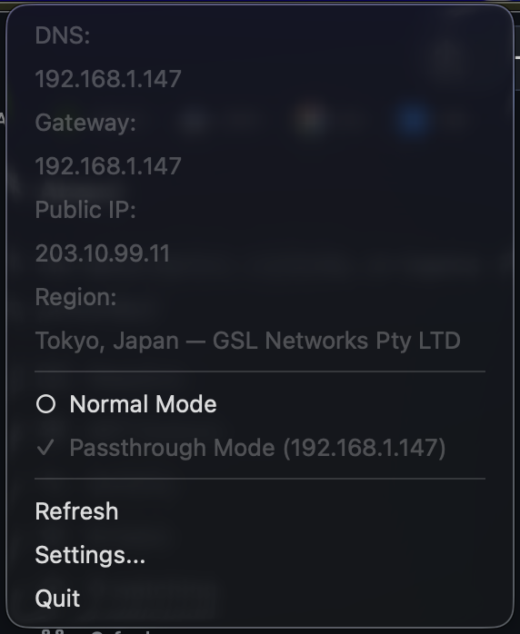

# GatewaySwitch

A macOS menu bar app to switch your network configuration between your ISP router and a passthrough gateway (side-router / VPN router).

When you enable **Passthrough Mode**, your Mac's IP configuration is set to manual with the side-router as the default gateway and DNS server. When you switch back to **Normal**, the network service reverts to DHCP and clears custom DNS — all with one click.

## Screenshot



## Features

- **Normal mode** — Reverts to DHCP (auto-assigned IP, router, and DNS)
- **Passthrough mode** — Sets manual IP (preserving current address/subnet), custom gateway, and DNS to your configured passthrough IP
- **Privilege escalation** — Uses `osascript` with administrator privileges for network configuration changes
- **Public IP display** — Shows current public IP and region via ip-api.com
- **Network scan** — ARP-based scan to discover live hosts with DNS (port 53) detection
- **Periodic refresh** — Auto-refreshes network info every 60 seconds
- **Bilingual** — English and Chinese language support, switchable from Settings
- **No dock icon** — Runs as a pure menu bar accessory

## Requirements

- macOS 13.0+
- No external dependencies (pure Swift Package Manager build)

## Quick Install

```bash
curl -fsSL https://raw.githubusercontent.com/PCHer/GatewaySwitch/master/install.sh | bash
```

This downloads the latest release, removes quarantine attributes, and installs to `/Applications`.

## Build & Run

```bash
./build.sh
```

Or with SwiftPM directly:

```bash
swift build
swift run
```

## Usage

1. Open `GatewaySwitch.app`
2. Click the gateway icon in the menu bar
3. Choose **Normal** for DHCP mode
4. Choose **Passthrough Mode** to route through your side-router
5. Use **Settings...** to configure the passthrough IP and language

## How it works

The app uses `networksetup` (not `route` commands) to change network settings at the service level, making it compatible with VPNs and more reliable across different network configurations. Privileged operations are performed via AppleScript's `do shell script with administrator privileges`.

## License

MIT
